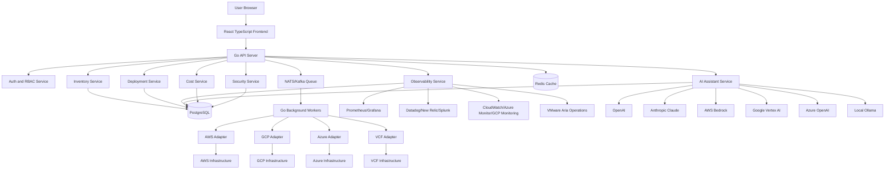

# Architecture

InfraSphere is split into a Go API, background workers, PostgreSQL, Redis, provider adapters, observability adapters, AI adapters, and a React TypeScript frontend. The MVP uses mock data behind production-shaped interfaces so real provider SDKs can be added without reworking the UI or API contract.

## Backend Services

The API exposes REST endpoints for auth, organizations, cloud accounts, inventory, deployments, observability, AI, cost, security, and audit logs. The worker process is the future home for scheduled inventory sync, deployment execution, cost ingestion, alert correlation, and AI post-processing.

## Frontend Architecture

The frontend is a Vite React app. It uses componentized pages, a shared API client, responsive CSS, compact dashboards, resource tables, deployment steps, and AI chat surfaces.

## Database Model

The PostgreSQL migration includes users, organizations, organization memberships, roles, permissions, cloud accounts, encrypted provider credentials, resources, relationships, deployments, deployment events, observability integrations, AI integrations, cost snapshots, alerts, incidents, audit logs, and API keys.

## Provider Abstraction

Providers implement `CloudProvider`: connect, validate credentials, list inventory, deploy workloads, query metrics, and query costs. Provider metadata is preserved in `Resource.Metadata` while normalized fields power filtering, topology, cost, and security views.

## Deployment Engine

Deployment states follow `DRAFT -> VALIDATING -> PLANNING -> WAITING_FOR_APPROVAL -> DEPLOYING -> VERIFYING -> SUCCESS/FAILED`, with rollback states available. Destructive or high-impact actions require explicit human approval.

## Observability Pipeline

The observability interface normalizes metrics, logs, traces, and alerts from Prometheus, Grafana, Datadog, New Relic, Splunk, Elastic, CloudWatch, Azure Monitor, GCP Monitoring, and VMware Aria Operations.

## AI Integration Layer

AI providers are treated as analysis engines. They can read inventory and observability context, recommend actions, generate plans and diffs, and cite sources. They cannot mutate infrastructure directly without approval.

## Security Model

Security centers on tenant isolation, JWT sessions, OIDC readiness, RBAC, encrypted credentials, redacted logs, audit trails, approval workflows, and least-privilege provider access.

